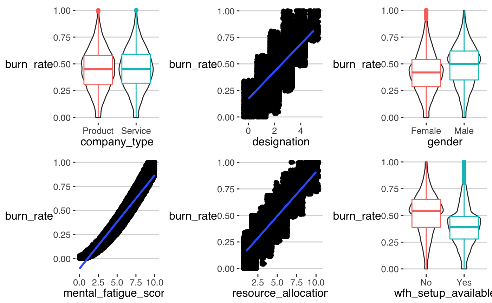
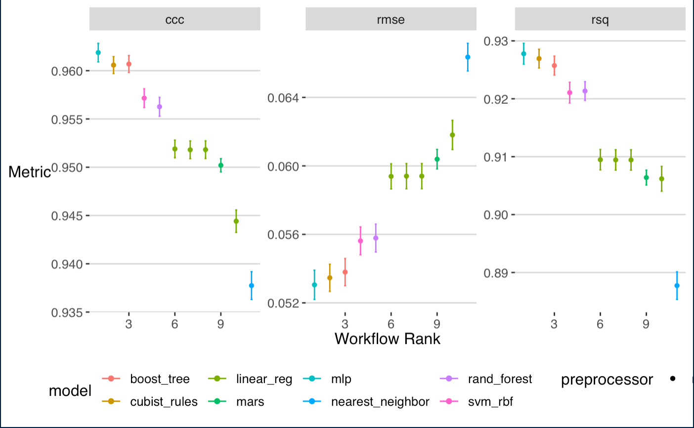

# [Project 1: Instagram Classification](https://github.com/ModelBehavior/InstagramSpamClassification/blob/main/Instagram_classification.Rmd)
## Spam Account Detection
### Data Description
Fakes and spammers are a major problem on all social media platforms, including Instagram. [kaggler](https://www.kaggle.com/free4ever1/instagram-fake-spammer-genuine-accounts) has personally identified the spammer/fake accounts included in this dataset after carefully examining each instance and as such the dataset has high level of accuracy. The dataset has been collected using a crawler from 15-19, March 2019. The response variable is fake, and is coded 0=genuine and 1=spam. There are 11 predictors in the data:

+ profile picture, user has profile picture, or not (coded 0=no picture, 1=has picture)
+ nums length user, this is the ratio of number of numerical chars in username to its length
+ full name words, full name in word tokens
+ nums length full name, the ratio of the number of numerical characters in full name to its length
+ name username, are username and full name literally the same (coded 0=not same, 1=same)
+ description length, bio length in characters
+ external url, has external url or not (coded 0=no external url, 1=has external url)
+ private or not, is the account set to  private viewer ship (coded 0=not private, 1=private)
+ posts, number of posts
+ followers, number of followers
+ follows, number of accounts followed

### Split Data
Before building these models, we will split the data into one set that will be used to develop models, preprocess the predictors, and explore relationships among the predictors and the response (the training set) and another that will be the final arbiter of the predictor set/model combination performance (the test set). To partition the data, the splitting of the orignal data set will be done in a stratified manner by making random splits in each of the outcome classes. This will keep the proportion of fake accounts approximately the same. In the splitting, 82% of the data were allocated to the training set. 10-fold cross-validation were used to tune the models

### Prepprocess
The predictors were transformed using yeoJohnson transformations, centered and scaled, searched for near zero variance predictors, and searched for a predictor space with kendal correlation less than .80.

### Modeling
While often overlooked, the metric used to assess the effectiveness of a model to predict the outcome is very important and can influence the conclusions. The metrics select to evaluate model performance depend on the response variable. The outcome being a binary categorical variable. Accuracy, sensitivity, specificity, kappa, and area under the curve were used to evaluate each model's performance. 

The models tried on this data include logistic regression, linear discriminant analysis, regularized discriminant analysis, flexible discriminant analysis, k-nearest neighbors, single-layer neural network, and C5 boosted trees.

### Logistic Model
This models was created usinhg the penalized version (elastic net) that conducts feature selection during model training. 10 values of the ridge and lasso penalty combinations were examined, using a space filling design.

### LDA Model
This models was created using the penalized version that conducts feature selection during model training. 10 values of the ridge penalty was investigated, using a space filling design.

### RDA Model
This model was created using a space filling design with 10 combination values for fraction common variance that toggles between LDA and QDA by putting a penalty on the covariance matrix $\lambda \Sigma_l + (1-\lambda)\Sigma$ when $\lambda$ is zero we get LDA and when $\lambda$ is 1 we get QDA. For $\lambda$ values between 0 and 1 we get something between LDA and QDA. Fraction identity buts a penalty on the pooled covariance matrix and allows the matrix to morph from its observed value to one where the predictors are assumed to be indepenent. Tuning an RDA model over these parameters enables the training data to decide the most appropriate  assumptions for the model.

### FDA Model
This model, first-degree and second-degree MARS hinge functions were used and the number of retained terms was varied from 2 to 12.

### KNN Model
this model, k varied from 1 to 10.

### NNet Model
Models were fit with hidden units ranging from 2 to 10 and 10 weight decay values determined using a space filling design.

### C5.0 Boosted Model
This model was evaluated with tree-based models, up to 100 iterations of boosting and tuned over sample_size and min_n.

### Training Results
The model results are shown below. The plot show the confidence interval of the resamples over the different metrics. The linear models did just as well as the non-linear models. The best non-linear model is the neural network and the best linear model is the logistic regression. To see if these two models are statistically different a t-test can be performed. I did not do this in this analysis.

# Results
The best two models were logistic regression and the single-layer neural network. We can see our models dropped in accuracy quite a bit on the testing data, and the logistic regression predicted one more class correctly than the single-layer neural network. The logistic regression model misclassified 12 observations, while the single-layer neural network misclassified 13. Given the simplicity of the logistic regression model, it would be chosen as the overall model. The logistic regression has a false positive rate of 10.77%. And a true positive rate of 91.8%. Meaning when the model predicts genuine, it is right 91.8% of the time, and when the model predicts spam, it is wrong 10.77% of the time.

# [Project 2: Are your Employees Mental Health at Risk?](https://github.com/ModelBehavior/Burn-Out-Prediction/blob/main/Burn_Out_Prediction.Rmd)
## Burn Out Prediction
### Data Description
Globally, World Mental Health Day is celebrated on October 10 each year. The objective of this day is to raise awareness about mental health issues around the world and mobilize efforts in support of mental health. According to an anonymous survey, about 450 million people live with mental disorders that can be one of the primary causes of poor health and disability worldwide. These days when the world is suffering from a pandemic situation, it becomes really hard to maintain mental fitness. The Variables are: 

+ **Employee ID**: The unique ID allocated for each employee (example: fffe390032003000)
+ **Date of Joining**: The date-time when the employee has joined the organization (example: 2008-12-30)
+ **Gender**: The gender of the employee (Male/Female)
+ **Company Type**: The type of company where the employee is working (Service/Product)
+ **WFH Setup Available**: Is the work from home facility available for the employee (Yes/No)
+ **Designation**: The designation of the employee of work in the organization. In the range of [0.0, 5.0] bigger is higher designation.
+ **Resource Allocation**: The amount of resource allocated to the employee to work, ie. number of working hours. In the range of [1.0, 10.0] (higher means more resource)
+ **Mental Fatigue Score**: The level of fatigue mentally the employee is facing. In the range of [0.0, 10.0] where 0.0 means no fatigue and 10.0 means completely fatigue.
+ **Burn Rate**: The value we need to predict for each employee telling the rate of Bur out while working. In the range of [0.0, 1.0] where the higher the value is more is the burn out.

### Inspiration
Try to build some really amazing predictions keeping in mind that happy and healthy employees are indisputably more productive at work, and in turn, help the business flourish profoundly.

### Split Data
Before modeling, the data was split into a training and testing set, and a seed was set for reproducibility. 80% of the data were randomly allocated to the training set. 10-fold cross-validation is used to split the data for tuning and evaluation of training models.

### Initail Data Analysis
Strong relationships can be seen in several of the plots. Resource allocation and designation seems like they can be encoded as a categorical variable. This is hard to see from the plots above, but individual plots of the variables show this. In the plot for mental fatigue score, we can see the fitted line goes below zero, which is problematic since the observed values of burn rate cannot be negative. This could be helped with a transfomation. Looking at the violin/boxplots, we can see that company type as pretty symmetrical distribution with respect to burn rate, as well as identical medians. Gender and wfh setup available appear to have skewed distribution with respect to burn rate and unequal medians. **NOTE: This is not a hypothesis test and could be different**.

# Metrics and Controls
The metrics used to investigate the models are RMSE, R-squared, CCC, and MAE.

# Linear Models
OLS, ridge, LASSO, elastic net regression was used on the data. The tuning parameters for the penalty models was found using 10-fold cross-validation over a random grid of 20 values.

### PreProcess
The numeric predictors were transformed using Yeojohnson transformations, centered and scaled, dummy variables were made for the nominal predictors, near-zero
variance filter was done on the predictor's space, and a correlation filter was done on the predictors.

# Non-Linear Models

### KNN
KNN was tuned over the number of neighbors (k) in the range 1-10 inclusive.

### MARS
MARS model was tuned over the degree of polynomial 1 or 2 and the number of terms to keep in the model.

### NNET
The single-layer neural network model tuned over the number of hidden units [1,10], dropout, weight decay, and 500 training iterations.

### SVM
A radial basis support vector machine tuned over cost, sigma, and margin with 20 randomly spaced values.

### Preprocess 
The preprocessing of the data for the non-linear models included centering and scaling numeric predictors, making dummy variables for all nominal predictors, and checking for near-zero variance predictors.

# Tree Models

### Random Forest
A random forest model, with mtry = 5, number of trees = 1000, and 20 random values of min_n

### Cubist Model
A Cubist Model tuned over the number of committees, neighbors, and rules. 50 evenly spaced random values were chosen for the grid.

### Boosted Tree
A boosted tree model was tuned over min n, tree depth, learn rate, loss reduction, and sample size. A grid of 50 evenly spaced values was chosen for the grid.

### Preprocess
Little preprocessing was done for the tree models. Dummy variables were made for the nominal predictors with one-hot encoding, and a near-zero variance filter for the predictor space. 

# Training Model Results
We can see that neural network, cubist, and boosted tree models are all within standard errors of each other. We can do a repeated-measures ANOVA to check if there are any differences between the models or use a paired t-test.

# Results 
We get a test set RMSE of 0.0534458.

# [Project 3: Fat Content With IR](https://github.com/ModelBehavior/tecator/blob/main/teactor.Rmd)
## Regression Analysis of Fat content using IR as Predictors
### Data Description
Infrared (IR) spectroscopy technology is used to determine the chemical makeup of a substance. The device measures the absorbance of the sample at each individual frequency. This series of measurements creates a spectrum profile which can then be used to determine the chemical makeup of the sample material. A Tecator Infratec Food and Feed Analyzer intrument was used to analyze 215 samples of meat across 100 frequencies. In addition to an IR profile, analytical chemistry determined the percent fat for each sample.

### Goals of Analysis
If we can establish a predictive relationship between IR spectrum and fat content, then food scientist could predict a sample's fat content, then food scientist could predict a sample's fat content with IR instead of analytical chemistry. This could provide cost savings, since analytical chemistry is  a more expensive, time-consuming process.

### Methodology
The data was split into a testing and training set, and different preprocessing methods were done. \
The predictors are highly correlated, so PCA was used to reduce the dimension of the predictor space. \
Cross-validation was done to find the optimal value of the tuning parameters for models that required this. \
The different types of models that fit the data were: bagged trees, boosted trees, cubist, linear regression, decision trees, MARS, neural networks, KNN, random forest, and SVM. \
The neural network model performed the best on the training data with an RMSE of .85088724 and a standard error of 0.03248912, followed by the cubist model.

### Results 
Applying the best model to the test set, we get an RMSE of .7274025 with an r-squared of 0.9968596.

# [Project 4: Wait Thats Spam!](https://github.com/ModelBehavior/Spam_Detection/blob/main/Spam%20Prediction.Rmd)

## Sentiment Analysis and Prediction of SMS Messages

# Questions:
+ Can we use this data to predict if a SMS message is spam?
+ What are the most common positive words?
+ What are the most common negative words?
+ What are the most important positive and negative words as described by the model? 

# Data
The dataset can be found [here](https://www.kaggle.com/uciml/sms-spam-collection-dataset). The SMS Spam Collection Dataset is a set of SMS tagged messages that have been collected for SMS Spam research. It contains one set of SMS messages in English of 5,574 messages, tagged acording being ham (legitimate) or spam.

# Methods
I used comparison word cloud for the most common positive and negative words. The size of a word's text is in proportion to its frequency within its sentiment. I used bing word bank for the sentiment analysis. I chose a lasso logistic model. This model does well on text data. I used single word tokens, convert tokens into weights using tfidf, only kept 500 tokens after removing stop words. The model is sensitive to centering and scaling, so I normalized the data. I used grid search to find the best penalty. I used bootstrap resampling to test the model before running the final model on the test set. It's easier to detect non-spam SMS messages than it is to detect spam SMS messages. Our overall accuracy rate is good at 96%

# Results

# Limitations and Next Steps
Things we can do to get better results: include not only unigrams but bi-grams, tri-grams, what stopwords make the most sense for my data, include more words in the word bank (I only included 500), we could choose a different weighting other than tfidf, we could try other types of models such as SVM or Naive Bayes.
